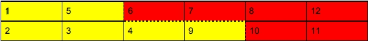

# HW2 Median of Two Sorted Array
## Pseudo code:
### O(N)
```
int Median()
{
    int index1=0, index2=0;
    for (run N+1 times)
    {
        if (Array1[index1] smaller than Array2[index2])
            index2++;
        if (run N times)
            record the value; //median1
        if (Array1[index1] smaller than Array2[index2])
            index++;
            if (run N times)
                record the value; //median2
    }
    return the average of two medians.
}

```
### O(lgN)
```
int Median()
{
    int index1, index2;
    while (index1 <= index2)
    {
        i = (index1+index2) / 2; //Point out where to cut Array1
        j = N-i; //Point out where to cut Array2

        if (Last element of Array1 greater than First element of Array2)
            index2 = i -1;
        else if(Last element of Array2 greater than First element of Array1)
            index1 = i+1;
        else
            Decide two medians
    }
    return the average of two medians.
}

```

# 解釋
## O(N):
First we assign two indexs point to the first element of Array1 and Array2, Then we start to
check which is smaller, Array1[index1] or Array2[index2], the smaller one’s index will +1.
When we count to N and N+1, which will be the medians since the size of full array is 2N.
Record the value and do the average will be the answer. Time complexity will be O(N).

## O(lgN):
We have two sorted array. First We divide Array1 to two parts. Then We also divide Array2
to two parts but the first part of Array1 plus Array2 will have the same size of the second part
of Array1 plus Array2. We want that all of the elements of the first part are smaller the
second part, so we check if the last element of the first part of Array1(5) is smaller than the
first element of the second part of Array2(10) and the first element of the second part of
Array1(6) is smaller than the last element of the first part of Array2(9). In that case, all of the
elements will be smaller than any element in second part.The median will be the max(the
last elements of the first part of Array1 and Array2) and the min(the first elements of the
second part of Array1 and Array2). If we haven’t reached the condition yet, we move the
cutpoint. So the first time we set the cutpoint in the middle of the Array1. It would be
something like T(N) = T(N/2), which complexity is O(lgN).

<br>


